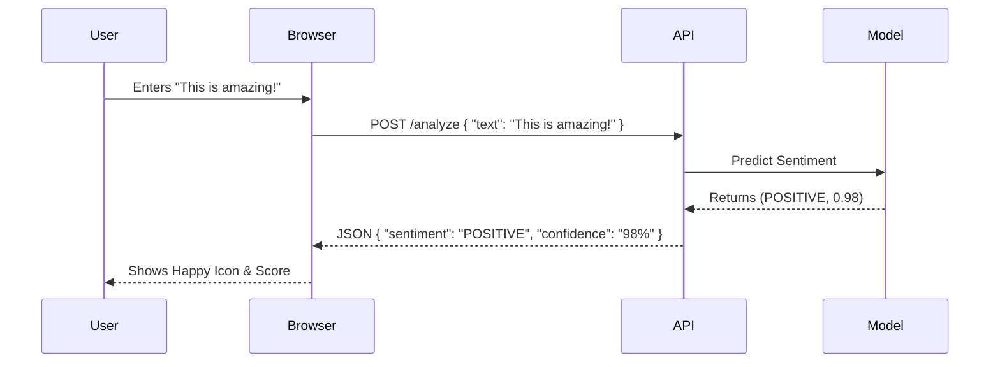

# FastAPI React Sentiment Analyzer

Welcome to the **FastAPI React Sentiment Analyzer**! This project is a powerful yet simple-to-use application that detects the sentiment (positive or negative) of any text you enter. It uses a state-of-the-art machine learning model (DistilBERT) in the backend and a clean, responsive interface in the frontend.

## Overview

Imagine you want to know if a movie review, a tweet, or a customer feedback is happy or sad. This tool does exactly that!
- **Backend**: A super-fast Python server using FastAPI that runs the AI model.
- **Frontend**: A beautiful web page built with React where you can type your text and see the results instantly.
- **AI Model**: We use DistilBERT, a lighter and faster version of the famous BERT model, to understand your text.

---

## Project Architecture

Here is a visual representation of how the project is structured and how data flows:

```mermaid
graph TD
    User[👤 User] -->|Types Text| FE[💻 Frontend (React)]
    FE -->|Sends API Request| BE[⚙️ Backend (FastAPI)]
    
    subgraph Backend Logic
        BE -->|Preprocess Text| MM[🧠 Model Manager]
        MM -->|Predict| AI[🤖 DistilBERT Model]
        AI -->|Result (Positive/Negative)| BE
    end
    
    BE -->|JSON Response| FE
    FE -->|Display Result| User
```

---

## Setup & Installation

Follow these easy steps to get the project running on your machine.

### Prerequisites
- You need to have **Python 3.8+** installed on your computer.

### 1. Backend Setup (The Brain)
The backend manages the AI model and handles requests.

1.  Open your terminal or command prompt.
2.  Navigate to the `backend` directory:
    ```bash
    cd backend
    ```
3.  Create a virtual environment (optional but recommended):
    ```bash
    python -m venv venv
    ```
    - Windows: `venv\Scripts\activate`
    - Mac/Linux: `source venv/bin/activate`
4.  Install the required libraries:
    ```bash
    pip install -r requirements.txt
    ```

### 2. Frontend Setup (The Face)
The frontend is the web page you interact with. It uses a simple HTTP server.

1.  Open a **new** terminal window.
2.  Navigate to the `frontend` directory:
    ```bash
    cd frontend
    ```

---

## How to Run

You need to run both the backend and the frontend at the same time in separate terminal windows.

### Step 1: Start the Backend Server
Inside the `backend` folder, run:
```bash
python main.py
```
> You will see a message saying the server is running at `http://localhost:8000`.

### Step 2: Start the Frontend
Inside the `frontend` folder, run a simple Python HTTP server:
```bash
python -m http.server 9000
```
> This starts a web server at port 9000.

### Step 3: Open the App
Open your web browser and go to:
**[http://localhost:9000/sentiment-analyzer.html](http://localhost:9000/sentiment-analyzer.html)**

---

## How It Works

1.  **Input**: You type a sentence like "I love this project!" in the text box on the web page.
2.  **Request**: When you click "Analyze", the frontend sends this text to the backend server (`http://localhost:8000/analyze`).
3.  **Analysis**:
    - The backend receives the text.
    - It cleans up the text (preprocessing).
    - It feeds the text to the **DistilBERT** model.
    - The model calculates the probability of the sentiment being Positive.
4.  **Response**: The backend sends back the **Sentiment** (POSITIVE/NEGATIVE) and a **Confidence Score** (e.g., 99.8%).
5.  **Display**: The frontend shows you the result with a nice icon and color!

### Detailed Logic Flow



---

## API Endpoints

The backend provides these simple endpoints:

| Method | Endpoint | Description |
| :--- | :--- | :--- |
| `GET` | `/` | API Information and usage examples. |
| `GET` | `/health` | Checks if the system and model are running healthy. |
| `POST` | `/analyze` | Main endpoint. Sends text and returns sentiment. |
| `POST` | `/analyze/batch` | Analyze a list of texts at once. |
| `GET` | `/models/info` | Get details about the loaded AI model. |

## Project Structure

```bash
fastapi-react-sentiment/
├── backend/                # Server-side code (Python)
│   ├── app/                # Main application logic
│   │   ├── api/            # API endpoints definition
│   │   ├── core/           # Configuration and Model Manager
│   │   └── utils/          # Helper functions
│   ├── main.py             # Entry point to run the backend
│   └── requirements.txt    # List of python libraries needed
│
├── frontend/               # Client-side code (HTML/JS/CSS)
│   ├── app.js              # React logic
│   ├── styles.css          # Styling for the page
│   └── sentiment-analyzer.html # Main HTML file
│
└── README.md               # This documentation file
```